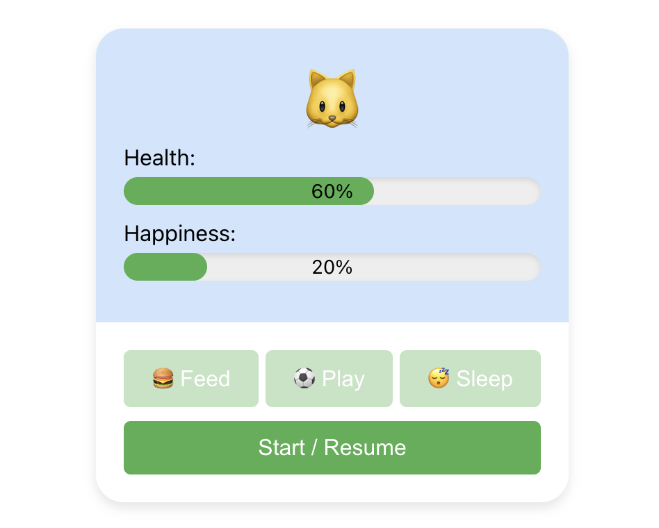

## React Virtual Pet

You can create / feed / interact with your virtual pet



Enjoy!

```
<link to GitHub pages>
```

## Development

```shell
npm i
```

```shell
npm run start
```

## Project Overview
This project is designed to simulate the experience of caring for a virtual pet. Users can interact with their pet through various activities that affect its health and happiness. The game demonstrates effective state management using React Hooks and provides an engaging user interaction model.

## Features
- Health Indicator: A visual gauge shows the pet’s health, which declines over time or due to neglect.
- Happiness Indicator: A meter indicates the pet's happiness, which can be increased through play and feeding.
- Play Function: Interactive play increases the pet's happiness.
- Sleep/Rest: Putting the pet to sleep allows health and happiness to regenerate.
- Feeding Mechanism: A button allows users to feed the pet, improving both health and happiness.
- Death and Restart: If the pet's health reaches zero, it will 'die'. Users can then choose to restart the game with a new pet.

## Technology Stack
- Frontend: React (Create React App)
- State Management: React Hooks (useState, useEffect, useCallback)
- Styling: CSS Modules for component-specific styling
- Deployment: GitHub Pages for hosting the live version of the game

## Component Architecture
- App Component: The main component that encapsulates the entire game logic and state.
- Pet Component: Displays the pet along with any animations or status changes.
- Controls Component: Includes interactive buttons for feeding, playing with, and putting the pet to sleep.
- Status Display Component: Shows real-time indicators for the pet’s health and happiness.
- Restart Component: Allows users to restart the game with a new pet upon the current pet's death.

## Data Flow
- State Management: Using useState to track and update the pet’s health, happiness, and activity states.
- Lifecycle Management: useEffect handles side effects such as automatic decrement of health and happiness and checks for the pet’s life conditions.