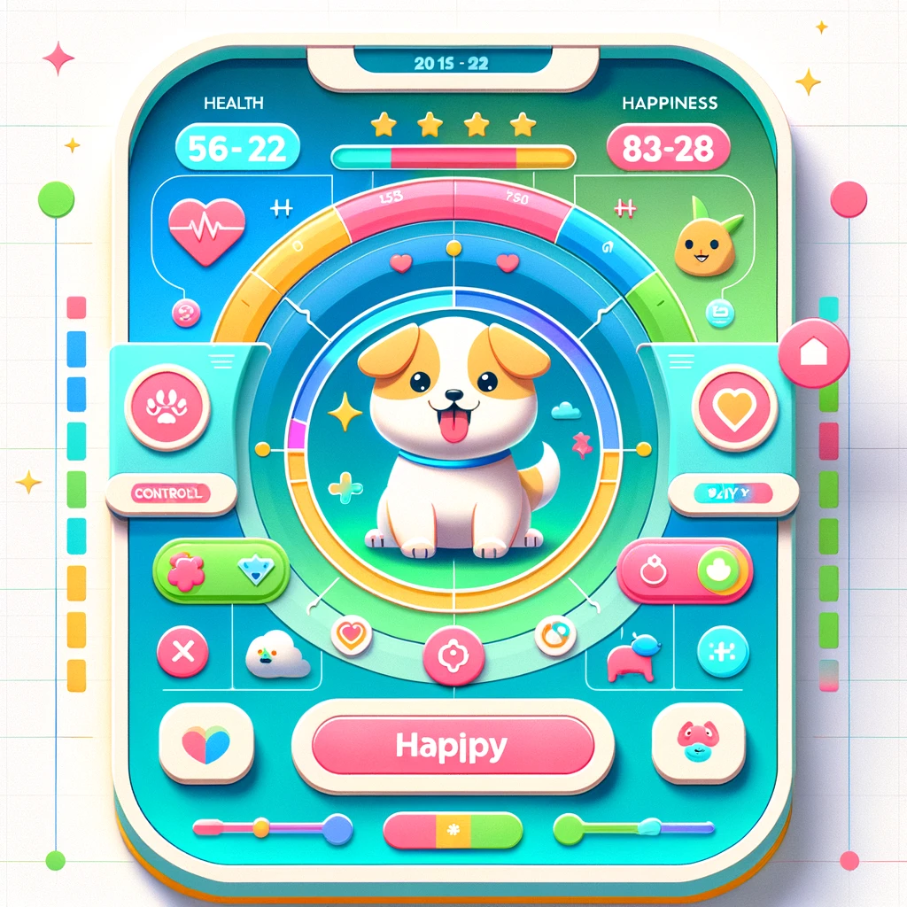

## React Virtual Pet

You can create / feed / interact with your virtual pet



Enjoy!

```
<link to GitHub pages>
```

## Development

```shell
npm i
```

```shell
npm run start
```

## Project Overview
This project aims to create a virtual pet game, similar to Tamagotchi, where users can interact with their virtual pet through various activities such as feeding, playing, and caring for it. The project will demonstrate the use of state management in React and provide a playful interaction experience.

## Features
* Pet Creation: Users can choose the type of pet and name it.
* Feeding Mechanism: Includes a button to feed the pet, affecting its health and happiness.
* Health Indicator: Visual indicator of the pet's health that decreases over time or as a result of neglect.
* Happiness Indicator: Measures the pet’s happiness, which increases with play and feeding.
* Play Function: Users can play with their pet to increase its happiness.
* Sleep/Rest: Pets can be put to sleep, during which health and happiness regenerate slowly.
* Death and Restart: The pet can 'die' if health reaches zero. Users can then restart with a new pet.

## Technology Stack
* Frontend: React (Create React App)
* State Management: React Hooks (useState, useEffect)
* Styling: CSS Modules
* Deployment: GitHub Pages

## Component Architecture
* App Component: Main component that holds the overall layout and state.
* Pet Component: Displays the pet and its animations.
* Controls Component: Buttons for feeding, playing, and sleeping functionalities.
* Status Display Component: Visual indicators for health and happiness levels.
* Restart Component: Button that allows restarting the game with a new pet after death.

## Data Flow
* Use `useState` to manage the states of health, happiness, and other attributes.
* `useEffect` will handle the lifecycle of the pet, including decrementing health and happiness over time and checking for the conditions of death.